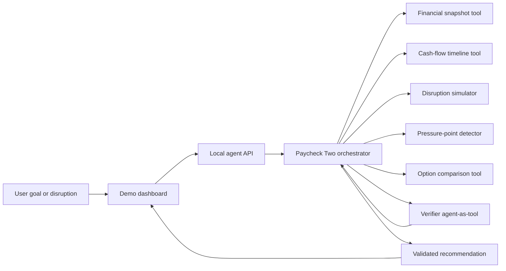

# Paycheck Two

> A Strands agent that helps people navigate the fragile period between paychecks by turning changing circumstances into a verified, evidence-backed plan.

**Project phase:** Agent foundation and integration<br>
**Last updated:** August 17, 2026

## The hackathon goal

Paycheck Two is an **agent project**, not primarily a budgeting website. The web interface is the demonstration surface for a Strands-native reasoning system.

People living paycheck to paycheck rarely have a static budgeting problem. A delayed deposit, smaller shift, surprise repair, or bill-date change can invalidate yesterday's plan. Paycheck Two should accept that open-ended situation, inspect the user's current financial snapshot, choose the appropriate analytical tools, simulate the disruption, compare possible responses, independently verify the resulting plan, and explain the tradeoffs without judgment.

The finished project should make the distinction between an LLM response and an agent obvious:

1. The model interprets the user's goal or disruption.
2. The Strands agent decides which tools it needs and invokes them.
3. Deterministic code performs all financial arithmetic.
4. The agent iterates when tool results reveal a shortfall or missing information.
5. A verifier agent checks grounding, assumptions, protected essentials, and safety.
6. The orchestrator returns a validated, structured action plan.
7. The UI shows both the result and a human-readable execution trace.

## Why Strands is central

The backend uses the official [`@strands-agents/sdk`](https://www.npmjs.com/package/@strands-agents/sdk) rather than a custom chat loop.

| Strands capability | How Paycheck Two uses it |
| --- | --- |
| `Agent` and the model-driven loop | The orchestrator selects tools and iterates based on their results. |
| Zod-backed function tools | Financial inputs are validated and calculations remain deterministic. |
| Agents as tools | A separate plan verifier is invoked by the orchestrator before the final response. |
| Structured output | Every recommendation must match a stable response schema. |
| Session management | Conversation state is persisted locally between invocations. |
| Lifecycle hooks | Before/after tool events create the trace shown in the demo. |
| Context management | Strands' automatic context strategy keeps longer sessions manageable. |
| Trace attributes | Agent spans are labeled for future OpenTelemetry export. |

The architecture intentionally uses one orchestrator and one verifier. More agents would only be added when they have genuinely different responsibilities; the project should demonstrate useful autonomy, not multi-agent complexity for its own sake.

## Architecture



Financial calculations are deliberately outside the model. The model decides *what needs to be analyzed*; tools determine *what the numbers are*.

## Current progress

### Agent core — implemented

- [x] Strands TypeScript SDK installed and configured for Amazon Bedrock
- [x] Primary `Paycheck Two` orchestrator with a domain-specific system prompt
- [x] Independent verifier implemented with Strands' agents-as-tools pattern
- [x] Structured recommendation schema with risk, evidence, options, actions, assumptions, and verification
- [x] Sequential tool execution for an understandable and reproducible trajectory
- [x] Persistent local Strands sessions via `SessionManager` and `LocalFileStorage`
- [x] Before/after tool hooks and a user-facing trace representation
- [x] Automatic context management and application trace attributes

### Deterministic financial tools — implemented

- [x] `get_financial_snapshot`
- [x] `build_cashflow_timeline`
- [x] `simulate_disruption`
- [x] `identify_pressure_points`
- [x] `compare_plan_options`
- [x] UTC-safe calendar arithmetic
- [x] Explicit protection of upcoming obligations and the user's safety buffer
- [x] Quantified warnings when an option reduces the buffer or assumes a bill can move

### Demonstration interface — implemented

- [x] Responsive paycheck dashboard
- [x] Editable balance, paycheck, payday, buffer, and bills
- [x] `/api/agent` connection to the real Strands backend
- [x] Backend health indicator
- [x] Collapsible human-readable agent tool trace
- [x] Clearly labeled deterministic fallback when the backend is unavailable
- [x] Local browser persistence for illustrative plan data

### Validation — implemented

- [x] Unit tests for baseline cash flow, delayed paychecks, surprise expenses, pressure points, option comparison, and date boundaries
- [x] Existing browser calculation tests
- [x] Initial agent evaluation cases with required trajectories and success criteria
- [x] TypeScript strict-mode checking
- [x] Production web build

## What remains

### Highest priority

- [ ] Run and tune the full agent loop against an enabled Bedrock model
- [ ] Capture successful real trajectories for the three evaluation scenarios
- [ ] Add an automated model-backed evaluation layer for tool selection, trajectory, helpfulness, goal completion, and harmful recommendations
- [ ] Stream Strands events to the browser instead of waiting for a complete response
- [ ] Add explicit human approval and a Strands interrupt before any future state-changing tool
- [ ] Export OpenTelemetry traces and include a polished trace view in the demo

### Before hackathon submission

- [ ] Add a guided demo mode for the compound “late paycheck plus car repair” scenario
- [ ] Demonstrate multi-turn session memory and a user correction changing the plan
- [ ] Add adversarial safety cases: prompt injection, predatory lending, skipped essentials, fabricated bill changes, and unsupported arithmetic
- [ ] Add latency, token, tool-use, and successful-plan metrics to the evaluation report
- [ ] Write the final architecture narrative and record the demo video
- [ ] Deploy the agent and web surface on AWS

### Production work outside the hackathon prototype

- [ ] Authentication and tenant isolation
- [ ] Explicit consent and encrypted persistence for real financial data
- [ ] Audited bank/transaction provider integration
- [ ] Reviewed financial guidance and regional compliance analysis
- [ ] Rate limiting, request correlation, structured logs, and operational alerting
- [ ] Accessibility audit and broader usability testing

## Run locally

### Requirements

- Node.js 20 or newer
- AWS credentials available to the standard AWS SDK credential chain
- Amazon Bedrock model access in the configured region

Install dependencies:

```bash
npm install
```

Copy the environment template if you need to change defaults:

```bash
cp .env.example .env
```

The current defaults are:

```text
AWS_REGION=us-east-1
STRANDS_MODEL_ID=global.anthropic.claude-sonnet-4-6
AGENT_PORT=8787
```

Environment variables must be loaded into the shell before starting the process; this project does not silently load `.env` yet.

Start the Strands backend and Vite interface together:

```bash
npm run dev
```

Then open `http://127.0.0.1:5173`. The web server proxies `/api` to the local agent on port `8787`.

Useful alternatives:

```bash
npm run dev:agent  # Strands API only, with watch mode
npm run dev:web    # Interface only; uses the clearly labeled local fallback
npm run agent      # Strands API without watch mode
```

### Bedrock troubleshooting

If `/api/health` succeeds but an agent request returns `AGENT_UNAVAILABLE`, verify:

1. AWS credentials are available to the process.
2. `AWS_REGION` is correct.
3. The account has access to `STRANDS_MODEL_ID` in Amazon Bedrock.
4. The selected model supports tool use and structured output.

The API never returns raw provider errors to the browser. The server console retains a concise diagnostic for local development.

## Validate the project

```bash
npm test
npm run typecheck
npm run build
npm run eval:fixtures
```

`eval:fixtures` validates the deterministic setup for the initial agent scenarios. It does **not** claim that the model-backed agent has passed those cases. Real trajectory evaluation remains an explicit milestone above.

## Intended demo

The strongest end-to-end scenario is:

> “I have $642, three bills due, my paycheck may be three days late, and I need a $300 tire to get to work. Help me protect the essentials.”

A successful trace should show:

1. `get_financial_snapshot`
2. `simulate_disruption`
3. `identify_pressure_points`
4. `compare_plan_options`
5. `verify_financial_plan`
6. A structured response that clearly identifies the shortfall, protects essentials, quantifies options, exposes assumptions, and requires approval for any external action

That trajectory is part of the product: judges should be able to see that Strands is doing meaningful orchestration rather than serving as a thin wrapper around one model call.

## Repository map

```text
.
├── app.js                         # Dashboard behavior and agent API client
├── index.html                     # Demonstration interface
├── styles.css                     # Responsive visual system
├── server/
│   └── index.ts                   # Local HTTP API for the Strands agent
├── src/
│   ├── plan.js                    # Existing browser-side calculations
│   └── agent/
│       ├── calculations.ts        # Deterministic cash-flow engine
│       ├── create-agent.ts        # Strands orchestrator, verifier, sessions, hooks
│       ├── plan-store.ts          # Request-scoped financial snapshot store
│       ├── prompts.ts             # Orchestrator and verifier behavior
│       ├── schemas.ts             # Zod request and structured-output contracts
│       ├── service.ts             # Application-facing agent service
│       └── tools.ts               # Strands financial tools
├── evals/
│   ├── cases.json                 # Agent scenarios, trajectories, success criteria
│   └── run-fixtures.ts            # Deterministic fixture validation
└── test/                           # Browser and backend calculation tests
```

## Safety and data boundaries

Paycheck Two currently has **read-only analytical tools**. It cannot transfer money, contact a biller, change a due date, apply for credit, or modify an account. Recommendations involving those actions must be described as options requiring explicit user approval.

The prototype sends the displayed plan from the browser to the locally running agent server. Strands session snapshots are written under `.strands/`, which is excluded from Git. Do not use real financial information in this hackathon build until authentication, encryption, retention controls, and explicit consent are implemented.

Paycheck Two provides planning guidance, not financial advice.
