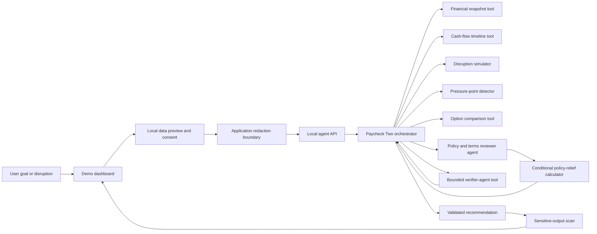

# Paycheck Two

> A Strands agent that helps people navigate the fragile period between paychecks by turning changing circumstances into a verified, evidence-backed plan.

**Project phase:** User safety, agent reliability, and evaluation<br>
**Last updated:** August 17, 2026

## The hackathon goal

Paycheck Two is an **agent project**, not primarily a budgeting website. The web interface is the demonstration surface for a Strands-native reasoning system.

People living paycheck to paycheck rarely have a static budgeting problem. A delayed deposit, smaller shift, surprise repair, or bill-date change can invalidate yesterday's plan. Paycheck Two should accept that open-ended situation, inspect the user's current financial snapshot, choose the appropriate analytical tools, simulate the disruption, compare possible responses, independently verify the resulting plan, and explain the tradeoffs without judgment.

The finished project should make the distinction between an LLM response and an agent obvious:

1. The model interprets the user's goal or disruption.
2. The Strands agent decides which tools it needs and invokes them.
3. Deterministic code performs all financial arithmetic.
4. The agent iterates when tool results reveal a shortfall or missing information.
5. A verifier agent checks grounding, assumptions, protected essentials, and safety.
6. The orchestrator returns a validated, structured action plan.
7. The UI shows both the result and a human-readable execution trace.

## Why Strands is central

The backend uses the official [`@strands-agents/sdk`](https://www.npmjs.com/package/@strands-agents/sdk) rather than a custom chat loop.

| Strands capability | How Paycheck Two uses it |
| --- | --- |
| `Agent` and the model-driven loop | The orchestrator selects tools and iterates based on their results. |
| Zod-backed function tools | Financial inputs are validated and calculations remain deterministic. |
| Agent composition | Separate bounded Strands agents review policies/terms and verify the complete recommendation. |
| Structured output | Every recommendation must pass a model-facing Zod contract and a deterministic application safety policy. |
| Session management | Sensitive sessions are ephemeral by default; local Strands file persistence is an explicit opt-in. |
| Lifecycle hooks | Tool events create the trace, measure stage duration, detect failures, and halt after validated structured output. |
| Context management | Strands' automatic context strategy keeps longer sessions manageable. |
| Trace attributes | Agent spans are labeled for future OpenTelemetry export. |
| Invocation limits | Turn, token, verifier, and wall-clock budgets bound every request. |

The architecture intentionally uses one orchestrator and two specialists with genuinely different responsibilities: a source-grounded policy reviewer and a whole-plan verifier. The project should demonstrate useful autonomy, not multi-agent complexity for its own sake.

## Architecture



Financial calculations are deliberately outside the model. The model decides *what needs to be analyzed*; tools determine *what the numbers are*.

## Current progress

### Agent core — implemented

- [x] Strands TypeScript SDK installed and configured for Amazon Bedrock
- [x] Primary `Paycheck Two` orchestrator with a domain-specific system prompt
- [x] Independent verifier agent invoked through a bounded, cancellation-aware Strands tool
- [x] Independent policy-and-terms reviewer with its own untrusted-content prompt, structured output, and execution budget
- [x] Structured recommendation schema with risk, evidence, options, actions, assumptions, and verification
- [x] Sequential tool execution for an understandable and reproducible trajectory
- [x] Ephemeral Strands sessions by default, with `SessionManager` and `LocalFileStorage` available only when the user turns private mode off
- [x] Before/after tool hooks and a user-facing trace representation
- [x] Automatic context management and application trace attributes
- [x] Per-request turn, output-token, total-token, and wall-clock limits
- [x] Independent verifier timeout that inherits outer-agent cancellation
- [x] Deterministic approval policy; the model classifies actions but cannot decide whether approval is required
- [x] Successful-structured-output lifecycle guard that prevents duplicate model turns
- [x] Canonical policy provenance enforced by application code rather than trusted to model output
- [x] Application-owned sensitive-data redaction before plans or policy text enter the Strands loop
- [x] Fail-closed sensitive-data scan on final recommendations
- [x] Request-scoped plan and policy cleanup after every ephemeral invocation, including failures

### Deterministic financial tools — implemented

- [x] `get_financial_snapshot`
- [x] `build_cashflow_timeline`
- [x] `simulate_disruption`
- [x] `identify_pressure_points`
- [x] `compare_plan_options`
- [x] `evaluate_policy_relief` for conditional what-if calculations tied to a reviewed source and matching unexpected expense
- [x] UTC-safe calendar arithmetic
- [x] Explicit protection of upcoming obligations and the user's safety buffer
- [x] Quantified warnings when an option reduces the buffer or assumes a bill can move

### Demonstration interface — implemented

- [x] Responsive paycheck dashboard
- [x] Editable balance, paycheck, payday, buffer, and bills
- [x] `/api/agent` connection to the real Strands backend
- [x] Backend health indicator
- [x] Collapsible human-readable agent tool trace
- [x] Clearly labeled deterministic fallback when the backend is unavailable
- [x] Local browser persistence for illustrative plan data
- [x] User entry for remembered policies, pasted provider terms, and direct provider confirmations
- [x] Visible policy-review trace and provenance labels in the response
- [x] Pre-model disclosure of destination, data categories, and automatic redactions
- [x] Explicit consent immediately before every model call
- [x] Private mode enabled by default and a user-controlled local-data deletion workflow

### Validation — implemented

- [x] Unit tests for baseline cash flow, delayed paychecks, surprise expenses, pressure points, option comparison, and date boundaries
- [x] Existing browser calculation tests
- [x] Initial agent evaluation cases with required trajectories and success criteria
- [x] TypeScript strict-mode checking
- [x] Production web build
- [x] Live evaluator for expected tools, failures, verifier use, numerical grounding, schema attempts, approvals, latency, cycles, and tokens
- [x] All three initial scenarios passed once through the genuine Bedrock-backed Strands loop
- [x] User-reported annual fee-waiver scenario passed through the orchestrator, policy reviewer, conditional calculator, and verifier
- [x] Adversarial tests for credentials, AWS keys, payment cards, bank/routing numbers, SSNs, emails, phones, consent, output leakage, and common financial false positives

## What remains

### Highest priority

- [x] Run the full agent loop against an enabled Bedrock Claude Sonnet 4.6 model
- [x] Capture a successful real trajectory for the compound late-paycheck-and-repair scenario
- [x] Tune the live loop from 11 cycles/multiple schema attempts to 4 cycles/one schema attempt on the compound case
- [x] Capture successful real trajectories for the baseline affordability and reduced-income scenarios
- [x] Automate checks for tool selection, trajectory, tool failures, verifier use, numeric grounding, approval policy, and execution metrics
- [ ] Run repeated trials to measure pass rate and latency variance rather than relying on one pass per scenario
- [ ] Add a model-backed semantic judge for helpfulness, goal completion, assumptions, and harmful recommendations
- [ ] Stream Strands events to the browser instead of waiting for a complete response
- [ ] Export OpenTelemetry traces and include a polished trace view in the demo
- [ ] Add current, location-aware suggestions for savings and support resources such as 211/help lines, food banks, benefit screening, utility relief, and transportation assistance
- [ ] Add trustworthy resource provenance, location consent, freshness checks, and a way to report unavailable or incorrect resources

### Before hackathon submission

- [ ] Add a guided demo mode for the compound “late paycheck plus car repair” scenario
- [ ] Demonstrate multi-turn session memory and a user correction changing the plan
- [ ] Add adversarial safety cases: prompt injection, predatory lending, skipped essentials, fabricated bill changes, and unsupported arithmetic
- [ ] Add adversarial policy-document cases: embedded prompt injection, outdated effective dates, conflicting clauses, missing pages, and unsupported eligibility claims
- [ ] Add file/PDF ingestion and page-level citations; the current milestone accepts typed knowledge or pasted relevant terms
- [x] Add latency, token, tool-use, schema-attempt, and successful-plan metrics to the live evaluation report
- [ ] Write the final architecture narrative and record the demo video
- [ ] Deploy the agent and web surface on AWS

### Production work outside the hackathon prototype

- [ ] Authentication and tenant isolation
- [x] Explicit per-request model-transmission consent in the local prototype
- [ ] Encrypted, authenticated persistence and a consent ledger for any real financial data
- [ ] Audited bank/transaction provider integration
- [ ] If state-changing money tools are ever introduced, require explicit human approval through a Strands interrupt before every external action
- [ ] Reviewed financial guidance and regional compliance analysis
- [ ] Rate limiting, request correlation, structured logs, and operational alerting
- [ ] Accessibility audit and broader usability testing

### Safety roadmap tied to feature work

- **File/PDF terms ingestion:** add size/type limits, isolated parsing, metadata removal, document-wide sensitive-data inspection, page-level provenance, prompt-injection fixtures, and explicit retention/deletion controls before accepting uploads.
- **Location-aware support resources:** request coarse location only when needed, explain why, avoid persistence by default, require current authoritative provenance, and add a narrow allowlist for verified public help-line phone numbers so the output scanner remains fail-closed for personal numbers.
- **AWS deployment:** replace local API keys with workload IAM roles and temporary credentials; add authentication, tenant isolation, TLS, rate limits, encrypted storage, bounded retention, safe audit metadata, secret scanning, AWS Budgets alerts, and deletion/export workflows.
- **Bedrock Guardrails and observability:** evaluate sensitive-information masking and prompt-attack filters as defense in depth. Before enabling invocation logging or OpenTelemetry export, prove that prompts, tool parameters, policy text, responses, and redaction matches cannot enter logs or traces.
- **Future account integrations:** complete a separate threat model, minimize OAuth scopes, use audited providers and token storage, support revocation, and preserve explicit human approval for every consequential external action.

## Run locally

### Requirements

- Node.js 20 or newer
- A Bedrock API key or AWS credentials available to the standard AWS SDK credential chain
- Amazon Bedrock model access in the configured region

Install dependencies:

```bash
npm install
```

Copy the environment template if you need to change defaults:

```bash
cp .env.example .env
```

The current defaults are:

```text
AWS_REGION=us-east-1
STRANDS_MODEL_ID=global.anthropic.claude-sonnet-4-6
AGENT_PORT=8787
STRANDS_MODEL_MAX_TOKENS=2500
STRANDS_TIMEOUT_MS=120000
STRANDS_VERIFIER_TIMEOUT_MS=45000
STRANDS_POLICY_REVIEW_TIMEOUT_MS=40000
STRANDS_TURN_LIMIT=9
STRANDS_OUTPUT_TOKEN_LIMIT=12000
STRANDS_TOTAL_TOKEN_LIMIT=100000
```

The agent server automatically loads the Git-ignored `.env` file for local development. Put `AWS_BEARER_TOKEN_BEDROCK` there rather than committing or hard-coding a key. Shell environment variables remain supported and take precedence over values loaded from `.env`.

When `AWS_BEARER_TOKEN_BEDROCK` is present, Paycheck Two passes it to the Strands `BedrockModel` through its explicit `apiKey` option. Otherwise, the AWS SDK standard credential chain is used.

The current Strands 1.13 integration also applies a narrow authorization-header normalization after the SDK's named bearer middleware. This prevents differently-cased SigV4 and bearer authorization headers from becoming a prohibited multi-value header in Node. A regression test covers the behavior; remove the compatibility layer once the upstream SDK normalizes these headers itself.

Start the Strands backend and Vite interface together:

```bash
npm run dev
```

Then open `http://127.0.0.1:5173`. The web server proxies `/api` to the local agent on port `8787`.

Useful alternatives:

```bash
npm run dev:agent  # Strands API only, with watch mode
npm run dev:web    # Interface only; uses the clearly labeled local fallback
npm run agent      # Strands API without watch mode
```

### Bedrock troubleshooting

If `/api/health` succeeds but an agent request fails, use its code to narrow the cause:

- `AGENT_UNAVAILABLE`: provider credentials, model access, region, or an unexpected runtime error
- `AGENT_INCOMPLETE`: the loop reached a time/turn/token budget or the mandatory verifier did not succeed
- `INVALID_AGENT_OUTPUT`: the returned plan failed the application safety contract
- `UNSAFE_AGENT_OUTPUT`: a final response contained a sensitive identifier and was blocked before display

For an unavailable provider, verify:

1. AWS credentials are available to the process.
2. `AWS_REGION` is correct.
3. The account has access to `STRANDS_MODEL_ID` in Amazon Bedrock.
4. The selected model supports tool use and structured output.

The API never returns raw provider errors to the browser. The server console retains a concise diagnostic for local development.

## Validate the project

```bash
npm test
npm run typecheck
npm run build
npm run eval:fixtures
npm run eval:live
```

`eval:fixtures` validates the deterministic setup without spending Bedrock tokens. `eval:live` runs all scenarios through the local API and genuine Strands/Bedrock loop. One or more fixture IDs can be supplied when resuming a run:

```bash
npm run eval:live -- late-paycheck-and-repair
```

The live runner uses a fixed `asOf` date and unique session ID so results are replayable without old session history. It fails if an expected tool is missing, any tool fails, structured output takes more than one attempt, the verifier is not applied, scenario numbers differ from deterministic calculations, policy findings lose their source grounding, approval policy is violated, or the agent does not finish with structured output. The natural-language success criteria remain visible for human review until a semantic judge is added.

## Latest live-agent results

On August 17, 2026, all three initial scenarios passed once against Claude Sonnet 4.6 through Amazon Bedrock using contract version 6. The first policy-knowledge scenario then passed on contract version 7. Contract version 8 adds the consent, redaction, and ephemeral-session boundary and has passed deterministic validation; its repeated live trials remain open:

| Scenario | Result | Wall time | Cycles | Tool calls | Total tokens | Schema attempts |
| --- | --- | ---: | ---: | ---: | ---: | ---: |
| Baseline affordability | Pass | 40.5 s | 3 | 4 | 15,513 | 1 |
| Late paycheck and repair | Pass | 80.9 s | 4 | 6 | 26,493 | 1 |
| Reduced income | Pass | 62.9 s | 4 | 6 | 24,157 | 1 |
| User-reported annual fee waiver | Pass | 111.1 s | 6 | 9 | 52,705 | 1 |

Every run used all expected tools, completed verification, had no tool failures, matched deterministic risk and safe-to-spend values, complied with the server-side approval policy, and produced valid structured output on its first attempt.

The policy scenario treated a `$35` overdraft fee as an unexpected expense and kept baseline `safeToSpend` at the deterministic `$212`. The remembered annual waiver remained labeled `user_reported`, required confirmation, and was evaluated only as conditional `$35` relief. The trace included `review_terms_and_policies`, `evaluate_policy_relief`, and `verify_financial_plan`; the application replaced the orchestrator's copied policy fields with the canonical reviewer result before returning the recommendation. The 111-second result also revealed unnecessary baseline/pressure/option calls, so the routing prompt now explicitly selects one primary calculation and avoids general comparison tools when conditional policy relief answers the question. That routing change still needs a repeated live trial.

The compound trajectory was:

1. `get_financial_snapshot`
2. `simulate_disruption`
3. `identify_pressure_points`
4. `compare_plan_options`
5. `verify_financial_plan`
6. `strands_structured_output`

It returned `riskLevel: "shortfall"` and `safeToSpend: 0`, grounded in the deterministic `$53` raw shortfall before optional changes. Compared with the first development baseline of approximately 148 seconds, 11 cycles, and repeated schema attempts, the current compound run is about 45% faster and uses 4 cycles with one schema attempt.

During tuning, a live run revealed that a successful Strands structured-output tool could be followed by duplicate model cycles in this integration. Paycheck Two now captures the successfully validated tool input and uses `AfterToolsEvent.endTurn` to halt that batch. Another run showed that a timed-out verifier could otherwise be followed by a plausible-looking final answer; the service now rejects any result without a successful verifier trace. These are reliability controls around the genuine agent loop, not replacements for it.

These results are development evidence, not yet a statistical reliability claim. Repeated trials, latency distributions, cost tracking, and semantic judging remain open work.

## Intended demo

The strongest end-to-end scenario is:

> “I have $642, three bills due, my paycheck may be three days late, and I need a $300 tire to get to work. Help me protect the essentials.”

A successful trace should show:

1. `get_financial_snapshot`
2. `simulate_disruption`
3. `identify_pressure_points`
4. `compare_plan_options`
5. `verify_financial_plan`
6. A structured response that clearly identifies the shortfall, protects essentials, quantifies options, exposes assumptions, and requires approval for any external action

That trajectory is part of the product: judges should be able to see that Strands is doing meaningful orchestration rather than serving as a thin wrapper around one model call.

A second showcase scenario demonstrates user-contributed knowledge:

> “A $35 overdraft fee hit today. I remember that my bank may waive one overdraft fee each year, but I do not know whether I have already used it. Can that help this paycheck?”

The desired behavior is to review the remembered policy as a lead, preserve the unknown annual usage, conditionally calculate the effect of a waiver, and verify the complete plan—without claiming that the bank was contacted or the fee was removed.

## Repository map

```text
.
├── app.js                         # Dashboard behavior and agent API client
├── index.html                     # Demonstration interface
├── styles.css                     # Responsive visual system
├── server/
│   └── index.ts                   # Local HTTP API for the Strands agent
├── src/
│   ├── plan.js                    # Existing browser-side calculations
│   └── agent/
│       ├── calculations.ts        # Deterministic cash-flow engine
│       ├── bedrock-auth.ts        # Bedrock API-key header compatibility layer
│       ├── create-agent.ts        # Strands orchestrator, verifier, sessions, hooks
│       ├── plan-store.ts          # Request-scoped financial snapshot store
│       ├── policy-review.ts       # Canonical policy-source enforcement
│       ├── prompts.ts             # Orchestrator, policy reviewer, and verifier behavior
│       ├── recommendation-policy.ts # Deterministic action-approval policy
│       ├── safety.ts              # Input inspection/redaction, consent preview, and output scan
│       ├── schemas.ts             # Zod request and structured-output contracts
│       ├── service.ts             # Application-facing agent service
│       └── tools.ts               # Strands financial tools
├── evals/
│   ├── cases.json                 # Agent scenarios, trajectories, success criteria
│   ├── run-fixtures.ts            # Deterministic fixture validation
│   └── run-live.ts                # Genuine Strands/Bedrock trajectory evaluation
├── test/                          # Browser and backend calculation tests
└── AGENTS.md                      # Persistent safety, AWS, and hackathon instructions
```

## Safeguards

User safety, data minimization, and protection of personally identifiable information (PII) and sensitive account information are core product requirements, not post-launch enhancements. Every new tool or integration should be reviewed for what data it receives, where that data is sent or stored, how long it is retained, and how a user can inspect or remove it.

Safeguards currently implemented:

- **Read-only scope:** Paycheck Two cannot transfer money, contact a biller, change a due date, apply for credit, or modify an account. It provides analysis and conditional options only.
- **Deterministic financial arithmetic:** Code—not the model—calculates balances, obligations, shortfalls, safe-to-spend amounts, timelines, option impacts, and conditional policy relief.
- **Mandatory independent verification:** The service rejects a recommendation unless the separate verifier agent completes successfully. The verifier checks arithmetic grounding, protected essentials, assumptions, unsafe borrowing, and unsupported policy claims.
- **Structured safety contracts:** Zod schemas constrain requests, tools, policy findings, action types, and final recommendations. Invalid agent output is rejected rather than shown as a completed plan.
- **Application-controlled approvals:** The model classifies proposed actions, but deterministic application policy decides whether they require approval. The model cannot make payments, contacts, transfers, account changes, or credit actions safe by setting a boolean.
- **Policy provenance:** Remembered policies remain labeled `user_reported`, require confirmation, and cannot contain invented document quotations. Explicit provider-terms findings require a supporting excerpt. Stored source metadata replaces model-copied provenance before a response is returned.
- **Untrusted-document boundary:** Pasted terms and policy text are treated as source data, not instructions. The policy reviewer is explicitly told to ignore prompts or commands contained inside source material.
- **Conditional benefits:** A possible waiver or benefit is modeled as conditional relief and is never counted as already granted. Relief cannot exceed the matching expense in the scenario.
- **Bounded execution:** Outer-agent, policy-reviewer, and verifier calls have time, turn, and token limits. Tool failures and incomplete verification prevent a successful response.
- **Secret handling:** Bedrock credentials belong in the Git-ignored `.env` file. The example environment file contains no credential, and provider errors are not returned raw to the browser.
- **Pre-model data boundary:** The local API inspects every free-text request surface and masks high-confidence card, bank/routing, SSN, AWS-key, credential, email, and phone patterns before placing the plan in the request-scoped store or invoking Strands.
- **Informed consent:** Every genuine agent request first shows the configured destination, categories of data that will be sent, and counts/types of automatic redactions. The model endpoint rejects requests without affirmative consent.
- **Ephemeral by default:** Private mode skips Strands `LocalFileStorage`; the request-scoped plan and policy context is cleared in a `finally` block on success or failure.
- **Output leak prevention:** Final structured recommendations are recursively inspected for sensitive identifiers and blocked before display if a match remains.
- **User-controlled deletion:** The interface can delete the locally saved plan, policy sources, and session identifier from browser storage. Private mode prevents new changes from being persisted.
- **Evaluation coverage:** Automated checks cover expected tool use, failed tools, numerical grounding, policy provenance, approval policy, verifier completion, and structured-output behavior.
- **Persistent implementation guidance:** Root-level `AGENTS.md` makes the safety gate, AWS practices, and hackathon priorities explicit for future development sessions.

Current safety limitations:

- The first-cut scanner is deterministic and intentionally limited to high-confidence patterns. It does not reliably identify names, postal addresses, customer IDs, contextual identifiers, every international format, sensitive images, or secrets with unusual formatting.
- Existing browser data is not automatically erased when private mode is enabled; the user-facing deletion control removes it. Browser local storage and opt-in Strands file sessions are not appropriate persistence for real financial data.
- The prototype has no user authentication, tenant isolation, encrypted application storage, consent ledger, or export workflow.
- Relevant plan and policy content, after the first-cut redaction boundary, is sent to the configured Bedrock model when the agent evaluates it.
- Pasted text is supported, but secure file/PDF ingestion and page-level citations are not yet implemented.
- Paycheck Two provides planning guidance, not financial, legal, tax, credit, medical, or emergency advice.

## Best practices for users

- Use fictional or heavily redacted information in the hackathon prototype.
- Never enter account or routing numbers, card numbers, Social Security or tax identifiers, login credentials, passwords, security answers, API keys, or one-time codes.
- Paste only the smallest relevant section of a policy or agreement. Remove names, addresses, customer IDs, barcodes, signatures, and unrelated transaction history first.
- Describe a remembered policy as something to investigate, not as a guaranteed entitlement. Confirm whether it is current, whether you are eligible, and whether you have already used a limited benefit.
- Check the provider, effective date, section, and surrounding language of pasted terms. Missing pages or conflicting clauses can materially change the result.
- Review saved policy sources regularly and use **Delete local data** when information is outdated or no longer needed.
- Confirm consequential interpretations directly with the relevant provider before relying on them.
- Keep a protected safety buffer where possible and do not use this tool as a substitute for professional or emergency assistance.
- Store AWS credentials only in `.env`, never `.env.example`, source files, screenshots, chat messages, or committed Git history.
